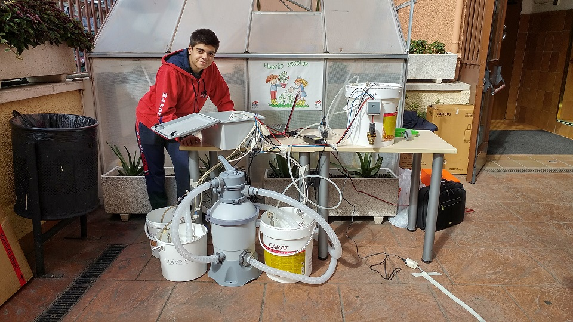
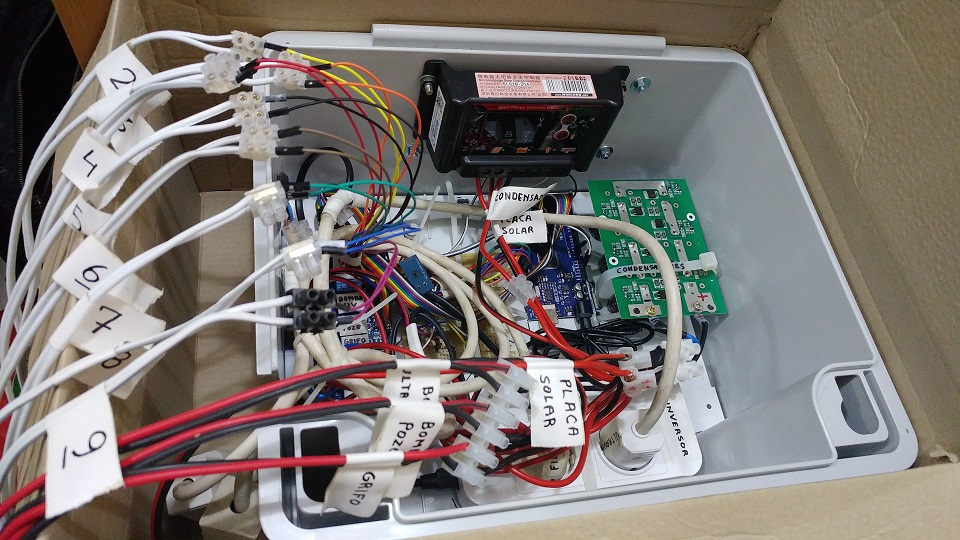

# Welcome to PurifyMyWater 
Here you can read about the hardware & software being used to bring to the world with a cheap DIY water purification system which can be assembled without great expenditures in expensive components. Our goal is to make purified water more accessible to those in dire need of it.

## About us
This project is being developed by a group of [students](https://github.com/vacmg/PurifyMyWater/graphs/contributors) of the UPM with the support of [**DLSIIS ETSIINF UPM**](https://www.dlsiis.fi.upm.es/) and [**ALUMNOS SOLIDARIOS**](https://www.joyfe.es/gente-joyfe/alumnos-solidarios/) initiative of JOYFE's school in Madrid.

Currently, we are developing and testing a prototype which will be deployed in the Kanhakro school and will supply around **1500L** of clean water per day to the school and the surrounding area.

Our project was included in a [**UNICEF video**](http://www.youtube.com/watch?v=UPMDZqc1k5A&t=4m5s) about solidarity and was selected by the [**Juan José Marquez foundation**](https://fundacionjjmarquez.org/) to bring water to a school located in Kanhakro, in Ivory Coast.

Deprecated documentation of the first **prototype** (currently we are developing the second hardware revision) including the manual can be found [**HERE**](https://drive.google.com/drive/u/1/folders/1oBQqVKW_CtPYmneLX6VQYX_fBKi4t3Yf)

 | 
------------ | -------------
This is an image of the protoytpe | This is the inside of the control unit

## Hardware
The main idea of this project is to use inexpensive parts to create a robust machine that is mostly self-sustainable and easily scalable. To achieve that, we have split the system into the control unit, and some peripherals. With little to no change to the control unit and the code, the water purification components can be expanded on to purify more water based on necessity.

Currently, we are working on a new and revised version of the water purifying system in aims of further increasing efficiency. As mentioned before, all the information of the first version is stored [**HERE**](https://drive.google.com/drive/u/1/folders/1oBQqVKW_CtPYmneLX6VQYX_fBKi4t3Yf)
- #### How it works?

Firstly, a pump gets water from the well and puts it in a surface tank. Then, the sand filter separates the clean water from the soil, and sends it to a UV tank.
The next step is to destroy any organism using a UV radiation light and then pump the water to a tank at a higher elevation than the rest of the installation.
From that tank, the water can be distributed as necessary.

- #### Energy management

This system gets all its energy from a **solar panel**. For better performance, its rated power should be at least 50% higher than the peripheral, as it needs more power. This is to ensure that it is capable of continuing to operate even in unfavorable weather conditions, such as rain or cloudy weather.

Instead of accumulating the energy in a battery, the lifespan of which is usually around 2 years, we use supercapacitors, which accumulate less energy (still enough to drive high loads for a short period of time), but last millions of charge and discharge cycles, thereby prolonging the amount of time the machine can be used without requiring the replacement of components. With the hardware configuration as it is, the system will not be in operation at night, however, as demonstrated though our reference design it will most certainly be capable of fulfilling the daily water needs of the populace. The reference design in question is capable of purifying 180L per hour, and as such it is capable of purifying 1500L in a day, in 8-9 hours of daily operation.

Our components use direct current but also alternative current, so we need to have a transformer to give the correct DC voltage (12V) and an inverter to provide us AC energy at the european standard voltage (230V). To carefully manage the electricity used in the system, we have an overvoltage control board for the capacitors and a few voltage and ampere meters in addition to a solid state relay that manages the energy input.

- #### Control unit

Our control unit packages all the electronics needed to control and supply energy to all the pumps and components used in the system.

## Software
Currently, our team is developing and testing a brand new prototype which will use better algorythms to get a huge improvement in efficiency.
